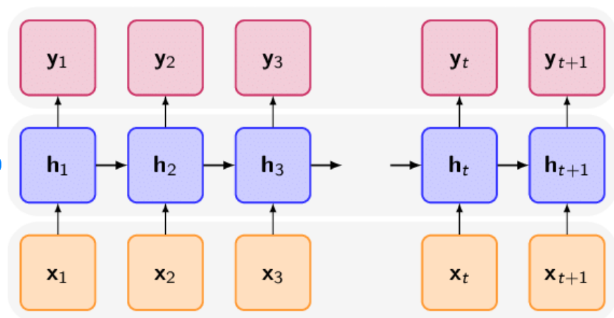
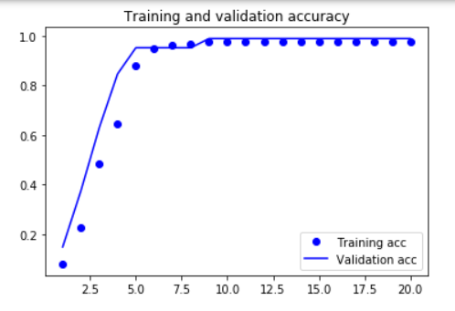
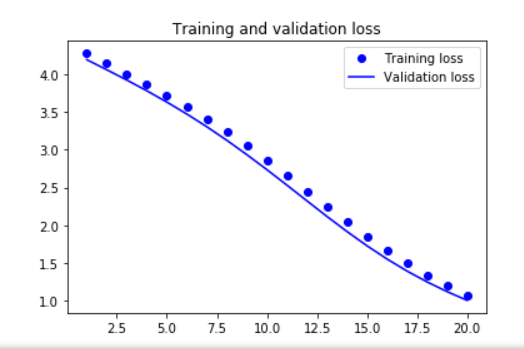
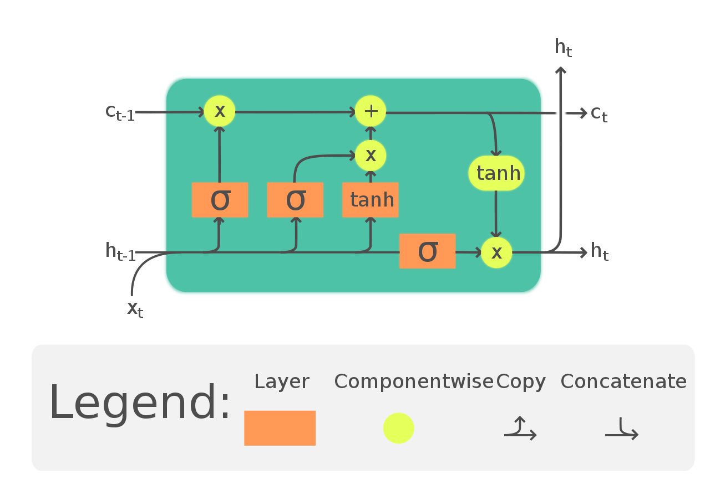
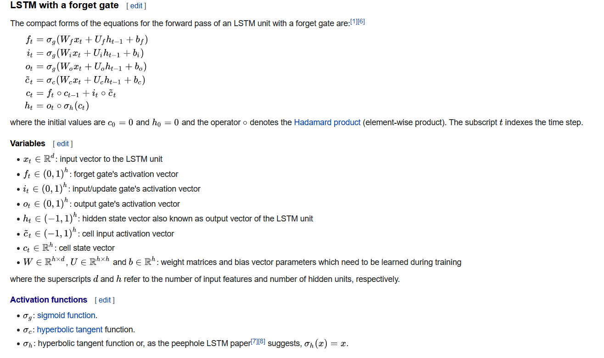
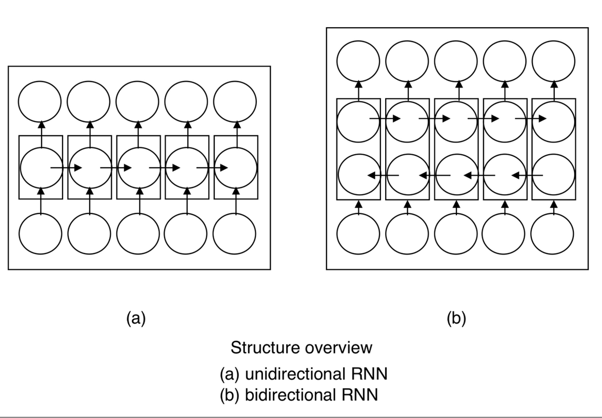
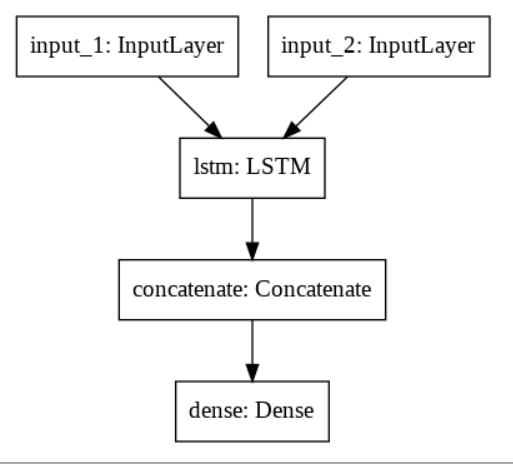
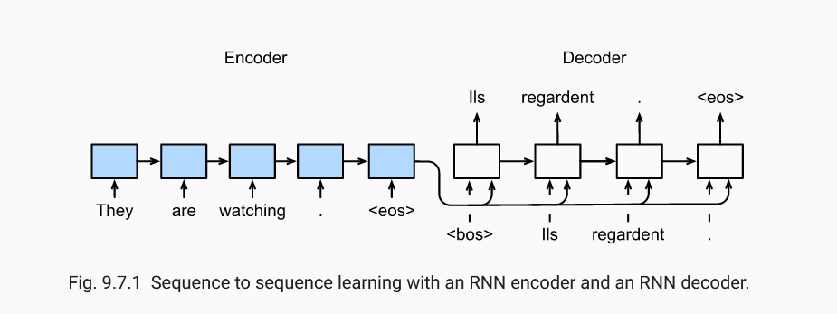
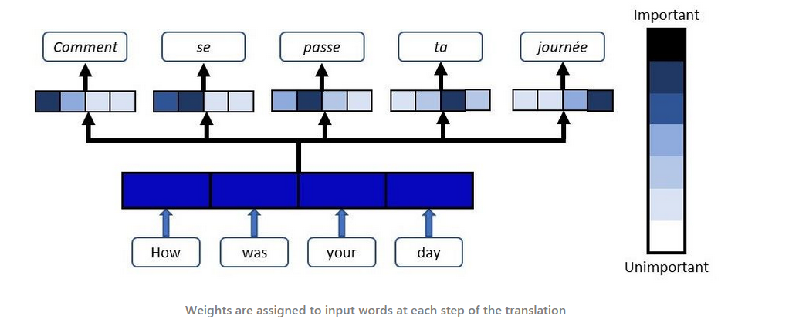

**NATURAL PROCESSING LANGUAGE**

Nathan MANZAMBI

**A draft of a book project.**

**Chapter I: Introduction**

**II.1. Introduction**

**\
**

**PART I: NATURAL PROCESSING LANGUAGE WITH SEQUENCE MODELS**

**\
**

**II.2. RECURRENT NEURAL NETWORK**

**II.2.1. Presentation**

A sequential data can be seen as a sequence of values ***x(1), . . . ,
x(τ)*** (Goodfellow, Bengio, & Courville, 2016)***.***

Learning sequential data can be a chore using a non-sequence model, the
sequence model as recurrent neural networks or RNNs has greater
performance than multilayer neural networks. (RUMELHART, SMOLENSKY,
McCLELLAND, & HINTON, 1986).

The recurrent network can read a sentence and extract a piece of the
required information wherever it appears: at the beginning, middle, or
end of the sentence. Because of its parameter sharing capabilities, this
is possible. (Goodfellow, Bengio, & Courville, 2016)

(Ng, 2021) gives a non-exhaustive example of domains where we can use
sequence models for classification or data generation:

-   **Speech recognition:** in this case, the input data in the dataset
    is the digital voice recording and the output is the text
    description of the input.

-   **Music generation:** in this special case, we can have nothing as
    input and get the sequence of music as output.

-   **Sentiment classification**: we predict a real value from a
    sequence of text

-   **DNA sequence analysis:** identification of features such as gene
    structures from a DNA sequence (Durbin, et al., 1998)***.***

-   **Machine translation:** an input text is in X language (for
    instance French) and the output text is in Y language( English)

-   **Video activity recognition:** the neural network read the video
    stream and try to predict the likelihood of action or event that
    occurs in the input video

-   **Named entity recognition:** the system learn to detect the name of
    an entity from a sequence of text

A recurrent neural network was designed for time-series data (RUMELHART,
SMOLENSKY, McCLELLAND, & HINTON, 1986). (Rumelhart, Hinton, & Williams,
1986). (ELMAN, 1990)

The structure of the network is comparable to it of a regular multilayer
perceptron, with the excellence that this allows connections among
hidden units related to a time delay. Through these connections, the
model memorize information about the past\
inputs, enabling it to find temporal correlations between events that
are possibly far-off from one another within the data. So RNNs have a
great learning property for time series (Pascanu, Mikolov, & Bengio,
2014).

The Recurrent Neural Network processes sequences: Nowadays, the RNN is
used on very large sorts of data including images (Sequential Processing
of Non-Sequence Data) (Li, Johnson, & Yeung, 2017)**,** voice or speech
data, text, etc.

In this section, we will present the RNNs with the simplest model called
"Vanilla" Recurrent Neural Network. This Vanilla RNN model has a single
hidden state and is a one-to-one architecture.

With this model, we will perform the forward and the backward
propagation. As an experience, we will learn the Vanilla to spell words.

Let h be the vector of the hidden state of the "Vanilla" RNN. So
**Figure 1.** shows the simple architecture of the recurrent neural
network.

At time t, the neuron receives as input, the dataset corresponding in
this timestamp (X~t~), and his previous state (h~t-1~), and then fits
his current state.

Once the state h~t~ is known, then the neural can estimate the output at
timestamp t, denoted pt that can be seen as the conditional probability
of getting the output when we know the past informations.

$\mathbf{p}_{\mathbf{t}}\mathbf{=}\mathbf{P}\left\lbrack \mathbf{y}_{\mathbf{t}}\mathbf{\ } \right|\mathbf{(}$x^1^,...,
x^t^$)\mathbf{\rbrack}$ (1)

This simple neuron learns by updating all the parameters of the network
with the Back Propagation Through a Time algorithm (**BPTT**).
(Goodfellow, Bengio, & Courville, 2016)

Although this simple model (Vanilla) is limited and not used for a
complex problem, it can be used as the foundation for understanding
other complex models and architectures.

Thus, when we stack many simple RNN layers each over the other, then we
will have RNN with a largely hidden layer. This deep architecture \[the
Deep recurrent network\] can learn complex classification.

(Pascanu, Mikolov, & Bengio, 2014) showed that the deep recurrent
networks are not easy to train due to vanishing and exploding gradient
problems. And so, The ***clipping gradient algorithm*** fixes the
exploding problem during the learning process.

Other architectures like **Long Short Term Memory** -- **LSTM**
(Mikolov, Joulin, Chopra, Mathieu, & Ranzato, 2014)**,** **Gated
Recurrent Unit -- GRU** (Chung, Gulcehre, Cho, & Bengio, 2014) overcome
and then fix the problem of vanishing gradient in deep learning models.

(Glorot & Bengio, Understanding the difficulty of training deep
feedforward neural networks, 2010) shows that a good **initialization of
weights** parameters can significantly reduce the exploding and
vanishing gradient issue***.***

**II.2.2. Types of RNN**

(Li, Johnson, & Yeung, 2017) describe 4 types of recurrent networks and
their applications

Each rectangle may be a vector and arrows represent functions (e.g:
matrix multiplication). Input vectors are in the bottom, output vectors
are at the top and the middle vectors hold the RNN\'s state. Notice that
in every case aren\'t any pre-specified constraints on the length
sequences because the recurrent transformation is fixed and might be
applied as repeatedly as we like (Li, Johnson, & Yeung, 2017).

-   **One-to-one**

-   **One-to-many**

-   **Many to one**

-   **Many-to-many**

-   **Many-to-many**:

**II.2.3. ACTIVATION FUNCTION**[^1]

The activation function of a neuron defines the output of that neuron
given an input or set of inputs (Hinkelmann, 2021)***.***

The most common activation functions can be **ridge** functions,
**radial** functions, and **fold** functions.

**A ridge function** is any function **f: R →**
$\mathbf{R}^{\mathbf{d}}$

which will be written because the composition of a univariate function
with a transformation, that is: **f ( x ) = g ( x ⋅ a )** for some **g:
R → R** and a ∈ $\mathbf{R}^{\mathbf{d}}$.

**A radial function** could be a function defined on a metric space
**R^n^** whose value at each point depends only on the gap between that
time and therefore the origin.

As an example, a radial function **Φ** in two dimensions has this form

$$\mathbf{\Phi}\ (x,y) = \gamma\ (r)\ ,\ r = \sqrt{x^{2}{+ y}^{2}}$$

Where $\gamma$ is a function of a single non-negative real variable.

In functional programming, **fold** (*also termed reduce, accumulate,
aggregate, compress, or inject*) refers to a family of higher-order
functions that analyze a recursive organization and thru the use of a
given combining operation, recombine the results of recursively
processing its constituent parts, build up a return value.

Typically, a fold is presented with a combining function, a top node of
a knowledge structure, and possibly some default values to be used under
certain conditions. The fold then proceeds to mix elements of the info
structure\'s hierarchy, systematically using the function.

Folds are in a very sense dual to unfolds, which take a seed value and
apply a function recursively to make a decision away to progressively
construct a corecursive arrangement, whereas a fold recursively breaks
that structure down, replacing it with the results of applying a
combining function at each node on its terminal values and therefore the
recursive results.

The following table compares the properties of several activation
functions that are functions of 1 fold x from the previous layer or
layers:

**Tableau 1: Neural Network Common Activation Functions**

+--------------------+----------------------------+--------------------+
| **Name**           | **Function, f(x)**         | **Derivate of f,   |
|                    |                            | f'**               |
+====================+============================+====================+
| **Identity**       | $$x$$                      | 1                  |
+--------------------+----------------------------+--------------------+
| Binary Step        | $$\left\{ \begin{matrix}   | $$\lef             |
|                    | 0\ if\ x < 0 \\            | t\{ \begin{matrix} |
|                    | 1\ if\ x\  \geq 1 \\       | 0\                 |
|                    | \end{matrix} \right.\ $$   |  if\ x\  \neq 0 \\ |
|                    |                            | undef              |
|                    |                            | ined\ if\ x = 0 \\ |
|                    |                            | \end{m             |
|                    |                            | atrix} \right.\ $$ |
+--------------------+----------------------------+--------------------+
| Logistic, sigmoid, | $$\sigma(x)                | $$f(x)\left( 1     |
| or soft step       |  = \frac{1}{1 + e^{- x}}$$ | - \ f(x) \right)$$ |
+--------------------+----------------------------+--------------------+
| Hyperbolic         | $$\tanh(x) =               | 1 - $f{(x)}^{2}$   |
| tangent: tanh      |  \frac{e^{x\ \ } - e^{- x} |                    |
|                    | }{e^{x\ \ } + \ e^{- x}}$$ |                    |
+--------------------+----------------------------+--------------------+
| Rectified linear   | $$\left\{ \begin{matrix}   | $$\lef             |
| unit (ReLU)        | 0\ if\ x\  \leq 0 \\       | t\{ \begin{matrix} |
|                    | x\ if\ x\  > 0 \\          | 0\ \ \ \ \ \ \ \   |
| (Nair & Hinton,    |  \\                        | \ \ \ \ \ \ \ \ \  |
| 2010)              | \end{matrix} \right.\ $$   | \ \ \ if\ x < 0 \\ |
|                    |                            | 1\ \ \ \ \ \ \     |
|                    | $$= \                      | \ \ \ \ \ \ \ \ \  |
|                    | max\left\{ 0,x \right\} =  | \ \ \ if\ x > 0 \\ |
|                    | x\ \ \ \mathsf{1ₓ\ ˲\ ₀}$$ | undef              |
|                    |                            | ined\ if\ x = 0 \\ |
|                    |                            | \end{m             |
|                    |                            | atrix} \right.\ $$ |
+--------------------+----------------------------+--------------------+
| Gaussian Error     | $$\frac{1}{2}x\left(       | $                  |
| Linear Unit (GELU) | 1 + {erf}\left( \frac{x}{\ | $\Phi(x) + xø(x)$$ |
|                    | sqrt{2}} \right) \right)$$ |                    |
| (Hendrycks &       |                            |                    |
| Gimpel, 2020)      | =x$\Phi(x)$                |                    |
+--------------------+----------------------------+--------------------+
| Softplus           | $$\ln{(1 + \ e^{2})}$$     | $$\frac{1          |
|                    |                            | }{1 + \ e^{- x}}$$ |
| (Glorot, Bordes, & |                            |                    |
| Bengio, Deep       |                            |                    |
| Sparse Rectifier   |                            |                    |
| Neural Networks,   |                            |                    |
| 2011)              |                            |                    |
+--------------------+----------------------------+--------------------+
| Exponential linear | $$\left\{ \begin{matrix}   | $$\lef             |
| unit (ELU)         | \mathcal{a}\ \left( e^{x}  | t\{ \begin{matrix} |
|                    | - 1 \right)if\ x \leq 0 \\ | \mathcal           |
| (Clevert,          | x\ \ \ \ \ \ \ \ \ \ \ \   | {a}e^{x}\ \ \ \ \  |
| Unterthiner, &     | \ \ \ \ \ \ if\ x > 0\  \\ | \ \ \ \ \ \ \ \ \  |
| Hochreiter, 2016)  | \end{matrix} \right.\ $$   | \ \ \ if\ x < 0 \\ |
|                    |                            | 1\                 |
|                    | With parameter 𝓪           | \ \ \ \ \ \ \ \ \  |
|                    |                            | \ \ \ \ \ \ \ \ \  |
|                    |                            | \ \ \ if\ x > 0 \\ |
|                    |                            | 1                  |
|                    |                            | \ if\ x = 0\ and\  |
|                    |                            | \mathcal{a} = 1 \\ |
|                    |                            | \end{m             |
|                    |                            | atrix} \right.\ $$ |
+--------------------+----------------------------+--------------------+
| Square linear unit | $$\left\{ \begin{matrix}   | $$\lef             |
| (SQLU)             | x\                         | t\{ \begin{matrix} |
|                    | \ \ \ \ \ \ \ \ \ \ \ \ \  | 1\ \ \ \ \ \       |
| (Adedamola,        | \ \ \ \ \ \ \ \ \ \ \ \ \  | \ \ \ \ \ \ \ \ \  |
| Nitish, & Kiong,   | \ \ \ \ \ \ \ \ \ \ \ \ \  | \ \ \ \ \ \ \ \ \  |
| 2021)              | \ \ if\ x > 0.0\ \ \ \ \ \ | \ \ \ \ \ \ if\ x  |
|                    |  \ \ \ \ \ \ \ \ \ \ \  \\ | > 0.0\ \ \ \ \  \\ |
|                    | \mathcal{a}{\l             | 1 + \ \frac{x}{2   |
|                    | eft. \ \left( x\  + \ \fra | }\ \ \ \ \ \ \ \ \ |
|                    | c{x^{2}}{4} \right.\  \rig |  \ \ \ if - 2.0\   |
|                    | ht)\ \ \ \ \ \ \ \ \ \ \ \ | \leq x\  \leq 0 \\ |
|                    |  \ \ \ \ \ \ \ \ \ if - 2. | 0\ \               |
|                    | 0\  \leq x\  \leq 0}^{} \\ |  \ \ \ \ \ \ \ \ \ |
|                    | \mathcal{- \ a\ \ \ \ \ \  |  \ \ \ \ \ \ \ \ \ |
|                    |  \ \ \ \ \ \ \ \ \ \ \ \ \ |  \ \ \ \ \ \ \ if\ |
|                    |  \ \ \ \ \ \ \ \ \ \ \ \ \ |  x\  < \  - 2.0 \\ |
|                    |  \ \ \ }if\ x < - 2.0\ \ \ | \end{m             |
|                    |  \ \ \ \ \ \ \ \ \ \ \  \\ | atrix} \right.\ $$ |
|                    | \end{matrix} \right.\ $$   |                    |
+--------------------+----------------------------+--------------------+
| Scaled exponential | λ$\left\{ \begin{matrix}   | λ$\lef             |
| linear unit (SELU) | \math                      | t\{ \begin{matrix} |
|                    | cal{a}\ \left( e^{x} - 1 \ | \mathcal           |
|                    | right)\ \ \ if\ x < 0\  \\ | {a}e^{x}\ \ \ \ \  |
|                    | x\ \ \ \ \                 | \ \ if\ x < 0\  \\ |
|                    |  \ \ \ \ \ \ \ \ \ \ \ \ \ | \ \ \ \            |
|                    |  \ \ \ if\ x \geq 0\ \  \\ | \ \ \ \ \ \ 1\ \ \ |
|                    | \end{matrix} \right.\ $    |  \ \ \ \ \ \ \ \ \ |
|                    |                            |  \ if\ x\  \geq 0\ |
|                    | with parameters λ = 1.0507 |  \ \ \ \ \ \ \  \\ |
|                    | and 𝓪 =1.67326             | \end{              |
|                    |                            | matrix} \right.\ $ |
+--------------------+----------------------------+--------------------+
| Leaky rectified    | $$\left\{ \begin{matrix}   | $$\lef             |
| linear unit (Leaky | 0.01x\ \ if\ x < 0 \\      | t\{ \begin{matrix} |
| ReLU)              | x\ \ \ \ \ \ \             | 0.                 |
|                    |  \ \ \ \ if\ x\  \geq 0 \\ | 01\ \ if\ x < 0 \\ |
|                    | \end{matrix} \right.\ $$   | x\ \ \ \ \ \ \ \ \ |
|                    |                            |  if\ x\  \geq 0 \\ |
|                    |                            | \end{m             |
|                    |                            | atrix} \right.\ $$ |
+--------------------+----------------------------+--------------------+
| Parameteric        | $$\left\{ \begin{matrix}   | $$\lef             |
| rectified linear   | \m                         | t\{ \begin{matrix} |
| unit (PReLU)       | athcal{a}x\ \ if\ x < 0 \\ | \mathcal{          |
|                    | x\                         | a\ \ }if\ x < 0 \\ |
|                    |  \ \ \ \ if\ x\  \geq 0 \\ | 1\ \ \             |
|                    | \end{matrix} \right.\ $$   |  if\ x\  \geq 0 \\ |
|                    |                            | \end{m             |
|                    | With parameter 𝓪           | atrix} \right.\ $$ |
+--------------------+----------------------------+--------------------+
| ElliotSig,         | $$\frac{x}{1 + \ |x|}$$    | $$\frac{1}{{(      |
|                    |                            | 1 + \ |x|)}^{2}}$$ |
|  Softsign          |                            |                    |
+--------------------+----------------------------+--------------------+
| Square             | $$\left\{ \begin{matrix}   | 1 +/-              |
| nonlinearity       | 1\ \ \ \                   | $\frac{x}{2}$      |
| (SQNL)             | \ \ \ \ \ \ \ \ \ \ \ \ \  |                    |
|                    | \ \ \ \ \ \ if\ x > 2.0 \\ |                    |
|                    | X - \                      |                    |
|                    | frac{x^{2}}{4}\ \ \ \ \ \  |                    |
|                    | \ \ \ \ \ \ \ \ \ \ \ \ \  |                    |
|                    | if\ 0 \leq x\  \leq 2.0 \\ |                    |
|                    | x + \ \frac{x^{2}}{4}\ \   |                    |
|                    | \ \ \ \ \ \ \ \ \ \ \ \ \  |                    |
|                    | if - 2.0\  \leq x\  < 0 \\ |                    |
|                    |  - \ 1\ \ \ \ \            |                    |
|                    | \ \ \ \ \ \ \ \ \ \ \ \ \  |                    |
|                    | \ \ \ \ if\ x < - 2.0\  \\ |                    |
|                    | \end{matrix} \right.\ $$   |                    |
+--------------------+----------------------------+--------------------+
| S-shaped rectified | $$\left\{ \begin{matrix}   | $$\lef             |
| linear activation  | tᵢ + \ \mathcal{aᵢ\ }(x    | t\{ \begin{matrix} |
| unit (SReLU)       |  - tᵢ)\ if\ x\  \leq tᵢ \\ | \mathcal{\         |
|                    | x\ \ \ \ \ \ \ \ \ \ \ \   |  aᵢ\ \ \ \ \ \ \ \ |
|                    |  \ \ \ \ \ \ \ \ \ \ \ \ \ |  \ \ \ \ \ \ \ \ } |
|                    |  \ \ \ \ if\ tᵢ < x\ tᵣ \\ | if\ x\  \leq tᵢ \\ |
|                    | tᵣ                         | 1\ \ \             |
|                    | + \ \mathcal{aᵢ}(x - tᵣ)\  | \ \ \ \ \ \ \ \ if |
|                    | \ \ \ \ if\ x\  \geq tᵣ \\ | \ tᵢ < x < tᵣ\  \\ |
|                    | \end{matrix} \right.\ $$   | \mathc             |
|                    |                            | al{aᵣ\ \ \ \ \ \ \ |
|                    | Where tᵢ,                  |  \ \ \ \ \ \ \ }if |
|                    | $\mathcal{aᵢ},\ tᵣ,\ \mat  | \ x \geq \ tᵣ\  \\ |
|                    | hcal{aᵣ}\ are\ parameters$ | \end{m             |
|                    |                            | atrix} \right.\ $$ |
+--------------------+----------------------------+--------------------+
| Bent identity      | $$\frac{\sqrt{             | $                  |
|                    | x^{2} + 1}\  - 1}{2} + x$$ | $\frac{x}{\sqrt[2] |
|                    |                            | {x^{2} + 1}} + 1$$ |
+--------------------+----------------------------+--------------------+
| Sigmoid linear     | $                          | $$\fra             |
| unit (SiLU,        | $\frac{x}{1 + \ e^{- x}}$$ | c{1 + \ e^{- x} +  |
|                    |                            | xe^{- x}\ }{{(1 +  |
|  Sigmoid           |                            | \ e^{- x})}^{2}}$$ |
| shrinkage,         |                            |                    |
|                    |                            |                    |
|  SiL, or Swish-‍1   |                            |                    |
+--------------------+----------------------------+--------------------+
| Gaussian           | $${e^{- x}}^{2}$$          | $${                |
|                    |                            | - 2xe^{- x}}^{2}$$ |
+--------------------+----------------------------+--------------------+
| SQ-RBF             | $$\left\{ \begin{matrix}   | $$\lef             |
|                    | 1 - \ \frac{x^{2}}{2}\ \   | t\{ \begin{matrix} |
|                    |  \ \ \ \ \ \ \ \ \ \ \ \ \ |  - x\ \            |
|                    |  \ \ \ \ if\ |x| \leq 1 \\ |  \ \ \ \ \ \ \ \ \ |
|                    | \frac{1}{2}{(2 - \ |x|)}   |  \ \ \ \ \ \ \ \ \ |
|                    | ^{2}\ if\ 1\  < |x| < 2 \\ |  \ \ \ \ \ \ \ \ \ |
|                    | 0\ \                       |  if\ |x| \leq 1 \\ |
|                    |  \ \ \ \ \ \ \ \ \ \ \ \ \ | x - 2sgn(x)if      |
|                    |  \ \ \ \ \ \ \ \ \ \ \ \ \ | \ 1 < \ |x| < 2 \\ |
|                    |  \ \ \ \ if\ |x| \geq 2 \\ | 0\ \ \ \ \         |
|                    | \end{matrix} \right.\ $$   |  \ \ \ \ \ \ \ \ \ |
|                    |                            |  \ \ \ \ \ \ \ \ \ |
|                    |                            |  \ \ \ \ \ \ \ \ \ |
|                    |                            |  if\ |x| \geq 2 \\ |
|                    |                            | \end{m             |
|                    |                            | atrix} \right.\ $$ |
+--------------------+----------------------------+--------------------+
| SOFTMAX            |                            |                    |
+--------------------+----------------------------+--------------------+
| Maxout             |                            |                    |
+--------------------+----------------------------+--------------------+
| FReLU              |                            |                    |
+--------------------+----------------------------+--------------------+

**II.2.4. Training recurrent networks**

Here below the algorithm for training a Machine learning algorithm
(Katanforoosh & Kunin, 2021)***.***

**II.2.4.1. Initialization**

> Initializing all the weights with zeros leads the neurons to find out
> the identical features during training. Initializing the weights with
> values too small leads respectively to slow learning and results in
> vanishing gradients. Too large value leads to divergence and results
> in exploding gradients (Katanforoosh & Kunin, 2021).
>
> Without mathematics justification, table 2 gives the list of some
> initialization techniques used in machine learning.

+------------+----------------------------------+----------------------+
| **Method   | **How is work**                  | **Comments**         |
| of         |                                  |                      |
| Initia     |                                  |                      |
| lization** |                                  |                      |
+============+==================================+======================+
| Identity   | This function can only be used   | The identity matrix  |
| i          | to generate 2D matrices.         | is generated by the  |
| nitializer |                                  | initializer.         |
+------------+----------------------------------+----------------------+
| Orthogonal | If the tensor to be initialized  | Initializer will     |
| i          | is two-dimensional, an           | generate an          |
| nitializer | orthogonal matrix produced from  | orthogonal matrix.   |
|            | the QR decomposition of a matrix |                      |
|            | of random integers chosen from a |                      |
|            | normal distribution is used to   |                      |
|            | initialize it. The output will   |                      |
|            | have orthogonal rows if the      |                      |
|            | matrix contains fewer rows than  |                      |
|            | columns. If this is not done,    |                      |
|            | the output will have orthogonal  |                      |
|            | columns.                         |                      |
|            |                                  |                      |
|            | If the tensor to be initialized  |                      |
|            | has more than two dimensions, a  |                      |
|            | shape matrix (shape\[0\] \*\...  |                      |
|            | \* shape\[n - 2\], shape\[n -    |                      |
|            | 1\]) is initialized, where n is  |                      |
|            | the length of the shape vector.  |                      |
|            | The matrix is then modified to   |                      |
|            | produce a tensor of the required |                      |
|            | form.                            |                      |
+------------+----------------------------------+----------------------+
| ### Varia  | Samples are taken from a         | Initializer capable  |
| nceScaling | truncated/untruncated normal     | of adapting its      |
|            | distribution with a mean of zero | scale to the shape   |
|            | and a standard deviation of one  | of weights tensors.  |
|            | when distribution=\"truncated    |                      |
|            | normal\" or \"untruncated        |                      |
|            | normal\" is specified (after     |                      |
|            | truncation, if used) stddev =    |                      |
|            | sqrt(scale / n), where n is one  |                      |
|            | of the following values:         |                      |
|            |                                  |                      |
|            | -   number of input units in the |                      |
|            |     weight tensor, if mode=\"fan |                      |
|            |     in\"                         |                      |
|            |                                  |                      |
|            | -   number of output units, if   |                      |
|            |     mode=\"fan out\"             |                      |
|            |                                  |                      |
|            | -   average of input and output  |                      |
|            |     unit numbers, if mode=\"fan  |                      |
|            |     avg\"                        |                      |
|            |                                  |                      |
|            | When distribution=\"uniform\" is |                      |
|            | specified, samples are selected  |                      |
|            | from a uniform distribution      |                      |
|            | within the bounds of \[-limit,   |                      |
|            | limit\], where limit = sqrt(3 \* |                      |
|            | scale / n).                      |                      |
+------------+----------------------------------+----------------------+
| Random     | $$\mathbf{W}^{\mathbf{l}         | Initializer will     |
| Normal     | }\mathbf{\ \sim\ }\mathcal{N}\le | generate tensors     |
| Init       | ft( \mathbf{\mu}\mathbf{,}\mathb | with a normal        |
| ialization | f{\sigma}^{\mathbf{2}} \right)$$ | distribution.        |
|            |                                  |                      |
|            | -   $\mathcal{N\ }means\ g       | For details about    |
|            | auss\ statistic\ distribution\ $ | the gauss            |
|            |                                  | distribution         |
|            | -   $\mu\ is\ the\ mean\ of\ th  |                      |
|            | e\ random\ values\ to\ generate$ | (Polyanin &          |
|            |                                  | Manzhirov)           |
|            | -   $\mathbf{\sigma}^{\mathb     |                      |
|            | f{2}}\ is\ the\ variance\ of\ th |                      |
|            | e\ random\ values\ to\ generate$ |                      |
+------------+----------------------------------+----------------------+
| Random     | $$\mat                           | The values created   |
| Truncated  | hbf{W}^{\mathbf{l}}\mathcal{\ \s | are identical to     |
| Normal     | im\ N}\left( \mathbf{\mu,}\mathb | those generated by a |
| Init       | f{\sigma}^{\mathbf{2}} \right)$$ | Random Normal        |
| ialization |                                  | initializer, with    |
|            |                                  | the exception that   |
|            |                                  | values more than two |
|            |                                  | standard deviations  |
|            |                                  | from the mean are    |
|            |                                  | rejected and         |
|            |                                  | redrawn.             |
+------------+----------------------------------+----------------------+
| Random     | A random variable X is uniformly | Initializer will     |
| uniform    | distributed on the interval      | generate tensors     |
| di         |                                  | with a uniform       |
| stribution | \[a, b\] if                      | distribution         |
| Init       | $p\ (x) = \ \frac{1}{b - a}$     |                      |
| ialization | *for x in* \[a,b\] where         |                      |
|            | *E(x)=*$\frac{(a + b)}{2}$ the   |                      |
|            | expected value of the random     |                      |
|            | variable                         |                      |
|            |                                  |                      |
|            | (Polyanin & Manzhirov)           |                      |
+------------+----------------------------------+----------------------+
| **Xavier   | $$\mathbf{W}^{\mathbf{           | Xavier               |
| Initia     | l}}\mathcal{\ \sim\ N}\mathbf{(} | Initialization       |
| lization** | \mathbf{\mu = 0,}\mathbf{\sigma} | maintains the same   |
|            | ^{\mathbf{2}}\mathbf{=}\left( \f | variance across all  |
| (Glorot &  | rac{\mathbf{1}}{\mathbf{n}^{\mat | layers and works     |
| Bengio,    | hbf{l - 1}}} \right)\mathbf{)}$$ | with tanh            |
| Und        |                                  | activations.         |
| erstanding | -   Biases are initialized with  |                      |
| the        |     zeros                        | (Katanforoosh &      |
| difficulty |                                  | Kunin, 2021)         |
| of         | -                                |                      |
| training   | $n^{l - 1}\ is\ the\ number\ of\ |                      |
| deep       |  the\ neurone\ in\ layer\ l - 1$ |                      |
| f          |                                  |                      |
| eedforward |                                  |                      |
| neural     |                                  |                      |
| networks,  |                                  |                      |
| 2010)      |                                  |                      |
+------------+----------------------------------+----------------------+
| **Xavier   | Draws samples from a uniform     |                      |
| uniform    | distribution within **\[-a,      |                      |
| ini        | a\],** where                     |                      |
| tializer** |                                  |                      |
|            | $$a = \sqrt{\frac{6}{\lef        |                      |
| (Glorot &  | t( n^{l - 1} + n^{l} \right)}}$$ |                      |
| Bengio,    |                                  |                      |
| Und        | -   $                            |                      |
| erstanding | n^{l - 1}\ is\ the\ number\ of\  |                      |
| the        | the\ neurone\ in\ laye\ l - 1\ $ |                      |
| difficulty |                                  |                      |
| of         | $or\ the\ number\ of\ input\ u   |                      |
| training   | nits\ in\ the\ weight\ tensor\ $ |                      |
| deep       |                                  |                      |
| f          | -   $n^{l}\ is\ the\ number\     |                      |
| eedforward |  of\ the\ neurone\ in\ layer\ l$ |                      |
| neural     |     or is the number of output   |                      |
| networks,  |     units                        |                      |
| 2010)      |                                  |                      |
+------------+----------------------------------+----------------------+
| **He       | $$\mathbf{W}^{\mathbf{           | If ReLU is used as   |
| initia     | l}}\mathcal{\ \sim\ N}\mathbf{(} | an activation        |
| lization** | \mathbf{\mu = 0,}\mathbf{\sigma} | function, a common   |
|            | ^{\mathbf{2}}\mathbf{=}\left( \f | initialization is He |
| (He,       | rac{\mathbf{2}}{\mathbf{n}^{\mat | initialization       |
| Zhang,     | hbf{l - 1}}} \right)\mathbf{)}$$ | (Katanforoosh &      |
| Ren, &     |                                  | Kunin, 2021).        |
| Sun, 2015) | -   Biases are initialized with  |                      |
|            |     zeros                        |                      |
|            |                                  |                      |
|            | $$                               |                      |
|            | n^{l - 1}\ is\ the\ number\ of\  |                      |
|            | the\ neurone\ in\ layer\ l - 1$$ |                      |
+------------+----------------------------------+----------------------+

> **Table 2: Initialization of parameters in Neural Network**

**II.2.4.2. Optimization & Hyperparameters tuning and Batch
Normalization**

+------------+---------------------+----------------------------------+
| **O        | **Update rule**     | **Characteristic**               |
| ptimizer** |                     |                                  |
+============+=====================+==================================+
| (S         | 𝑊= 𝑤𝑊 -- 𝓪𝑑𝑊        | -   Gradient descent can use     |
| tochastic) |                     |     parallelization efficiently  |
| Gradient   |                     |     but is very slow when the    |
| Descent    |                     |     data set is larger than the  |
|            |                     |     GPU\'s memory can handle.    |
|            |                     |     The parallelization          |
|            |                     |     wouldn\'t be optimal.        |
|            |                     |                                  |
|            |                     | -   Stochastic gradient descent  |
|            |                     |     usually converges faster     |
|            |                     |     than gradient descent on     |
|            |                     |     large datasets, because      |
|            |                     |     updates are more frequent.   |
|            |                     |     Plus, the stochastic         |
|            |                     |     approximation of the         |
|            |                     |     gradient is usually precise  |
|            |                     |     without using the whole      |
|            |                     |     dataset because the data is  |
|            |                     |     often redundant.             |
|            |                     |                                  |
|            |                     | -   Of the optimizers profiled   |
|            |                     |     here, stochastic gradient    |
|            |                     |     descent uses the least       |
|            |                     |     memory for given batch size. |
+------------+---------------------+----------------------------------+
| Momentum   | 𝑉𝑑𝑤 = 𝛽𝑉𝑑𝑤 + (1 -   | -   Momentum usually speeds up   |
|            | 𝛽) 𝑑𝑊               |     the learning with a very     |
|            |                     |     minor implementation change. |
|            | 𝑊=𝑊 -- 𝓪𝑉𝑑𝑊         |                                  |
|            |                     | -   Momentum uses more memory    |
|            |                     |     for a given batch size than  |
|            |                     |     stochastic gradient descent  |
|            |                     |     but less than RMSprop and    |
|            |                     |     Adam.                        |
+------------+---------------------+----------------------------------+
| RMSprop    | 𝘚𝑑𝑤 = 𝛽𝘚𝑑𝑤 + (1 -   | -   RMSprop's adaptive learning  |
|            | 𝛽)${dW}^{2}$        |     rate usually prevents the    |
|            |                     |     learning rate decay from     |
|            | 𝑊=                  |     diminishing too slowly or    |
|            | 𝑊-                  |     too fast.                    |
|            | 𝓪$\frac{dW}{\sqrt{\ |                                  |
|            | mathsf{S}dw}\ \ \   | -   RMSprop maintains            |
|            | + \ \ \varepsilon}$ |     per-parameter learning       |
|            |                     |     rates.                       |
|            |                     |                                  |
|            |                     | -   RMSprop uses more memory for |
|            |                     |     a given batch size than      |
|            |                     |     stochastic gradient descent  |
|            |                     |     and Momentum, but less than  |
|            |                     |     Adam.                        |
+------------+---------------------+----------------------------------+
| Adam       | 𝑉𝑑𝑤=𝛽₁ 𝑉𝑑𝑤 + (1 -   | -   The hyperparameters of Adam  |
|            | 𝛽₁) 𝑑𝑤              |     (learning rate, exponential  |
| **         |                     |     decay rates for the moment   |
| *(Diederik | 𝘚𝑑𝑤 = 𝛽₂ 𝘚𝑑𝑤 +(1 -  |     estimates, etc.) are usually |
| P. Kingma  | 𝛽₂)${\ dw}^{2}$     |     set to predefined values     |
| et al.,    |                     |     (given in the paper), and do |
| 2017).***  | 𝑉 corr              |     not need to be tuned.        |
|            | 𝑑𝑤=$                |                                  |
|            | \frac{Vdw}{{(1\  -  | -   Adam performs a form of      |
|            | \ \ \beta ₁)}^{t}}$ |     learning rate annealing with |
|            |                     |     adaptive step-sizes.         |
|            | 𝘚 corr              |                                  |
|            | 𝑑𝑤=$                | -   Of the optimizers profiled   |
|            | \frac{Vdw}{{(1\  -  |     here, Adam uses the most     |
|            | \ \ \beta ₂)}^{t}}$ |     memory for a given batch     |
|            |                     |     size.                        |
|            | 𝑊=                  |                                  |
|            | 𝑊-𝓪$\frac{Vco       | -   Adam is often the default    |
|            | rr\ dw}{\sqrt{\math |     optimizer in machine         |
|            | sf{S}corrdw}\ \ \   |     learning.                    |
|            | + \ \ \varepsilon}$ |                                  |
+------------+---------------------+----------------------------------+
| [A         |                     |                                  |
| dadelta](h |                     |                                  |
| ttps://ker |                     |                                  |
| as.io/api/ |                     |                                  |
| optimizers |                     |                                  |
| /adadelta) |                     |                                  |
+------------+---------------------+----------------------------------+
| [Adagrad]( |                     |                                  |
| https://ke |                     |                                  |
| ras.io/api |                     |                                  |
| /optimizer |                     |                                  |
| s/adagrad) |                     |                                  |
+------------+---------------------+----------------------------------+
| [Adamax]   |                     |                                  |
| (https://k |                     |                                  |
| eras.io/ap |                     |                                  |
| i/optimize |                     |                                  |
| rs/adamax) |                     |                                  |
+------------+---------------------+----------------------------------+

> **Tableau 3: Optimizer** f : R d → R {\\displaystyle f:\\mathbb {R}
> \^{d}\\rightarrow \\mathbb {R} }

**II.2.4.3. Metrics**

A metric is a function that is used to evaluate the model\'s
performance.

Metric functions are similar to loss functions in that the results of
assessing a metric are not utilized to train the model. It should be
noted that any loss function may be used as a metric.

-   **Accuracy Metrics** (accuracy_metrics, 2021)

+------------------+---------------------------------------------------+
| **Metrics name** | **Characteristic**                                |
+==================+===================================================+
| Accuracy         | Class name in Keras: **Accuracy**                 |
|                  |                                                   |
|                  | Calculates the frequency with which forecasts and |
|                  | labels match. This measure generates two local    |
|                  | variables, total and count, which are used to     |
|                  | determine the frequency with which y pred matches |
|                  | y true. This frequency is eventually delivered as |
|                  | binary accuracy: an idempotent operation that     |
|                  | simply divides total by count.                    |
|                  |                                                   |
|                  | Weights are set to 1 if sample weight is None.    |
|                  | Mask values with a sample weight of 0.            |
+------------------+---------------------------------------------------+
| ###              | ### Class name in Keras: **BinaryAccuracy**       |
| Binary Accuracy  |                                                   |
|                  | ### Calculates the fr                             |
|                  | equency with which forecasts match binary labels. |
|                  |                                                   |
|                  | ### This measure g                                |
|                  | enerates two local variables, total and count, wh |
|                  | ich are used to calculate the frequency with whic |
|                  | h y pred and y true coincide. This frequency is e |
|                  | ventually delivered as binary accuracy: a simple  |
|                  | idempotent operation that divides total by count. |
|                  |                                                   |
|                  | ### Weights are set to one if sample weight is    |
|                  |  None. To mask values, use a sample weight of 0.  |
+------------------+---------------------------------------------------+
| ### Categ        | ### Class name in Keras: **CategoricalAccuracy**  |
| orical Accuracy  |                                                   |
|                  | Calculates the frequency with which predictions   |
|                  | match one-hot labels. Because the argmax of       |
|                  | logits and probabilities are the same, you may    |
|                  | supply logits of classes as y pred.               |
|                  |                                                   |
|                  | This measure generates two local variables, total |
|                  | and count, which are used to calculate the        |
|                  | frequency with which y pred and y true coincide.  |
|                  | This frequency is eventually returned as          |
|                  | categorical accuracy: a simple idempotent         |
|                  | operation that divides total by count.            |
|                  |                                                   |
|                  | y pred and y true should be provided in as        |
|                  | probability vectors rather than labels. Use       |
|                  | tf.one hot to expand y true as a vector if        |
|                  | required.                                         |
|                  |                                                   |
|                  | Weights are set to one if sample weight is None.  |
|                  | To mask values, use a sample weight of 0.         |
+------------------+---------------------------------------------------+
| ### TopK Cate    | ###                                               |
| gorical Accuracy |  Class name in Keras: **TopKCategoricalAccuracy** |
|                  |                                                   |
|                  | Calculates how frequently targets appear in the   |
|                  | top K predictions.                                |
+------------------+---------------------------------------------------+
| ###              | Class name in Keras:                              |
|  Sparse TopK Cat | **SparseTopKCategoricalAccuracy**                 |
| egoricalAccuracy |                                                   |
|                  | Calculates how frequently integer targets appear  |
|                  | in the top K predictions.                         |
+------------------+---------------------------------------------------+

**Table 4: Accuracy Metrics in Keras**

-   [**Probabilistic
    metrics**](https://keras.io/api/metrics/probabilistic_metrics)

+------------------+---------------------------------------------------+
| **Metrics name** | **Characteristic**                                |
+==================+===================================================+
| Binary           | ### Class in Keras: **BinaryCrossentropy**        |
| Crossentropy     |                                                   |
|                  | The crossentropy metric between labels and        |
|                  | predictions is computed. When there are just two  |
|                  | label classes, this is the crossentropy metric    |
|                  | class to employ (0 and 1).                        |
+------------------+---------------------------------------------------+
| Categorical      | ### Class in Keras: **CategoricalCrossentropy**   |
| Crossentropy     |                                                   |
|                  | ### The crossentrop                               |
|                  | y metric between labels and predictions is comput |
|                  | ed. When there are several label classes, this is |
|                  |  the crossentropy metric class to utilize (2 or m |
|                  | ore). We presume that labels are supplied as a on |
|                  | e hot representation in this case. For example, i |
|                  | f the values of the **labels are \[2, 0, 1\], y_t |
|                  | rue = \[\[0, 0, 1\], \[1, 0, 0\], \[0, 1, 0\].**  |
+------------------+---------------------------------------------------+
| ###              | ### C                                             |
| Sparse Categoric | lass in Keras: **SparseCategoricalCrossentropy**  |
| al Crossentropy  |                                                   |
|                  | The crossentropy metric between labels and        |
|                  | predictions is computed. When there are two or    |
|                  | more label classes, use this crossentropy         |
|                  | measure. We anticipate that labels will be given  |
|                  | as integers. Please use the                       |
|                  | CategoricalCrossentropy metric if you want to     |
|                  | give labels using a one-hot representation. For y |
|                  | pred, there should be \# floating point values    |
|                  | per feature and a single floating point value per |
|                  | feature for y_true.                               |
|                  |                                                   |
|                  | There is a single floating point value per        |
|                  | example for y true and \# classes floating point  |
|                  | values per example for y pred in the excerpt      |
|                  | below. y true has the shape \[batch size\] while  |
|                  | y pred has the shape \[batch size, num classes\]. |
+------------------+---------------------------------------------------+
| ##               | ### Class in Keras: **KLDivergence**              |
| Kullback-Leibler |                                                   |
|                  | The Kullback-Leibler divergence measure between y |
| (KL) Divergence  | true and y pred is computed.                      |
|                  |                                                   |
|                  | **metric = y_true \* log(y_true / y_pred)**       |
+------------------+---------------------------------------------------+
| Poisson          | ### Class in Keras: **Poisson**                   |
|                  |                                                   |
|                  | The Poisson metric between y true and y pred is   |
|                  | computed.                                         |
|                  |                                                   |
|                  | **metric = y_pred - y_true \* log(y_pred)**       |
+------------------+---------------------------------------------------+

**Table 5: Probabilistic Metrics in Keras**

-   [Regression
    metrics](https://keras.io/api/metrics/regression_metrics)

+------------------+---------------------------------------------------+
| **Metrics name** | **Characteristic**                                |
+==================+===================================================+
| **Mean Squared   | ### Class in Keras: **MeanSquaredError**          |
| Error**          |                                                   |
|                  | The mean sq                                       |
|                  | uared error between y_true and y_pred is computed |
+------------------+---------------------------------------------------+
| **Root Mean      | ### Class in Keras: **RootMeanSquaredError**      |
| Squared Error**  |                                                   |
|                  | The root mean squared error metric between y true |
|                  | and y pred is computed.                           |
+------------------+---------------------------------------------------+
| **Mean Absolute  | ### Class in Keras: **MeanAbsoluteError**         |
| Error**          |                                                   |
|                  | ### The mean absolute erro                        |
|                  | r between the labels and predictions is computed. |
+------------------+---------------------------------------------------+
| **Mean Absolute  | ###                                               |
| Percentage       |  Class in Keras: **MeanAbsolutePercentageError**  |
| Error**          |                                                   |
|                  | ### The mean absolute percen                      |
|                  | tage error between y true and y pred is computed. |
+------------------+---------------------------------------------------+
| **Mean Squared   | ##                                                |
| Logarithmic      | # Class in Keras: **MeanSquaredLogarithmicError** |
| Error**          |                                                   |
|                  | ### The mean squared logarit                      |
|                  | hmic error between y true and y pred is computed. |
+------------------+---------------------------------------------------+
| **Cosine         | ### Class in Keras: **CosineSimilarity**          |
| Similarity**     |                                                   |
|                  | The cosine similarity between the labels and      |
|                  | predictions is computed.                          |
|                  |                                                   |
|                  | cosine similarity = (a . b) / \|\|a\|\| \|\|b\|\| |
|                  |                                                   |
|                  | ###                                               |
+------------------+---------------------------------------------------+
| **Log Cosh       | ### Class in Keras: **LogCoshError**              |
| Error**          |                                                   |
|                  | The logarithm of the hyperbolic cosine of the     |
|                  | prediction error is computed.                     |
|                  |                                                   |
|                  | logcosh = log((exp(x) + exp(-x))/2), where x is   |
|                  | the error (y_pred - y_true)                       |
|                  |                                                   |
|                  | ###                                               |
+------------------+---------------------------------------------------+

**II.2.4.4. The loss (or the cost) function or Maximum Likelihood
Estimation**

The same function used in metrics can be used as loss function.

Maximum likelihood estimation (MLE) is a statistical approach for
estimating the parameters of a probability distribution by maximizing a
likelihood function, so that the observed data is most likely under the
assumed statistical model. The maximum likelihood estimate is the point
in the parameter space that maximizes the likelihood function. Because
the logic of maximum likelihood is both straightforward and adaptable,
it has become a prominent approach of statistical inference.

If the probability function is differentiable, the derivative test can
be used to determine maxima. In certain instances, the likelihood
function\'s first-order requirements can be solved explicitly
(Wikipedia, 2021).

**II.2.4.5. Learning Process: Computing the gradient in a Recurrent
Neural Network (Back propagation through time: BPTT)**

{width="6.3in"
height="3.261111111111111in"}

Figure 7 An RNN unrolled in time (to be changed)

Source of photo: (researchgate, 2021)

Let consider now the case of the network with theses below
specifications as in the above figure:

-   The recurrence is on the hidden unit

-   The hidden recurrent unit use the hyperbolic tangent (tanh) as the
    > activation function

$$\mathbf{h}_{\mathbf{t}}\mathbf{= tanh}\left( \mathbf{W}_{\mathbf{xh}}\mathbf{*}\mathbf{X}_{\mathbf{t}}\mathbf{+ \ }\mathbf{W}_{\mathbf{hh}}\mathbf{*\ }\mathbf{h}_{\mathbf{t - 1}}\mathbf{+}\mathbf{b}_{\mathbf{h}} \right)\mathbf{\ \ \ (2)}$$

> **h~t~:** is the current state of the neuron on timestamp t
>
> **h~t-1~:** represents the previous state of the neuron
>
> **W~xh~:** the wire between the entries and the hidden neuron
>
> **W~hh~:** the recursive wire of the hidden neuron through the time
>
> **b**~n~**:** the bias vector of the hidden neuron

-   The final output is computed with softmax as the activation function

$$\mathbf{p}_{\mathbf{t}}\mathbf{=}\mathbf{y}_{\mathbf{t}}^{\mathbf{\hat{}}}\mathbf{= softmax(}\mathbf{W}_{\mathbf{hy}}\mathbf{*\ }\mathbf{h}_{\mathbf{t}}\mathbf{+ \ }\mathbf{b}_{\mathbf{y\ }}\mathbf{)\ \ \ \ (3)}$$

> **p~t~:** the estimation of the output
>
> **W~hy~:** the wire between the hidden neuron and the output neuron
>
> **b**~y~**:** the bias vector of the output neuron

-   The loss function is the negative log-likehood of the true target
    > (the cross entropy loss)

$\mathbf{L = -}\mathbf{log}\mathbf{(}\mathbf{p}_{\mathbf{t}}\mathbf{)}$
**(4)**

-   The job to do is to minimize to the loss function using an
    > optimization algorithm(ADAM, gradient descent, etc.) . So in each
    > step, we will compute the gradient of loss function:

    -   For each node of the network: **the output o, the hidden h**

    -   For each parameters of the network: **W~x~, W~h~, W~y~, b~h~ and
        b~y~** respectively for input to hidden, hidden to hidden,
        hidden to output, hidden bias, and output bias

**II.2.5. Experimentation**

-   **Description of the experimentation**

In this section, we will give the RNN the task to spell a CAMARA LAY
poem (Figure 7).

The RNN was implemented using Python with Tensorflow and Keras. All
weights are **Xavier** initialized. The hyperbolic tangent is used as
activation function in the hidden RNN layer, and the softmax as
activation function in the dense layer (the output layer) and **ADAM**
as an optimizer, **categorical_crossentropy** as a loss function, and
accuracy as metrics.

-   **Forward propagation**

> Equations (2) and (3) are examples of what was done in Python, Tensor
> flow, and Keras backend during the forwarding propagation for the RNN
> in ***figure8***. The "**tanh**" and **softmax** are both used as the
> activation function.
>
> {width="4.470833333333333in"
> height="3.0756944444444443in"}

Figure 9. Learning Model of character spelling

On the first stage of forwarding propagation, we calculate the signal of
the hidden neuron using the hyperbolic tangent (equation 2), and then,
we do the same on the output neuron using the softmax as activation
function (equation 3).

-   **Optimization**

    -   optimizer=\"adam\"

    -   batch_size=128

    -   epochs=20

    -   validation_split=0.2

-   **Results**

We obtained an accuracy of 97.48% on the train set and 98.94% on the
validation set

> {width="3.877606080489939in"
> height="2.192775590551181in"}

Figure 10. Training and Validation accuracy

> {width="4.054446631671041in"
> height="2.700384951881015in"}

Figure 11. Training and Validation loss

**II.3. LONG SHORT TERM MEMORY -- LSTM**

Long short-term memory (LSTM) is a deep learning artificial recurrent
neural network (RNN) architecture. Unlike traditional feedforward neural
networks, LSTM has feedback connections. It is capable of processing not
just single data points (such as pictures), but also whole data
sequences (such as speech or video). For example, LSTM may be used for
tasks such as unsegmented, connected handwriting identification, speech
recognition, and anomaly detection in network traffic or intrusion
detection systems (IDSs) (intrusion detection systems). (Hochreiter &
Schmidhuber, 1997) (Long_short-term_memory, 2021)

Classic (or \"vanilla\") RNNs, in principle, may maintain track of
arbitrary long-term relationships in input sequences. The difficulty
with vanilla RNNs is computational (or practical) in nature: while
back-propagating a vanilla RNN, the long-term gradients might \"vanish\"
(that is, trend to zero) or \"explode\" (that is, tend to infinity) due
to the calculations involved in the process, which employ
finite-precision integers. Because LSTM units enable gradients to flow
unaltered, RNNs employing LSTM units partially address the vanishing
gradient problem. However, the ballooning gradient problem can still
affect LSTM networks. (Long_short-term_memory, 2021) (Ng, 2021)

{width="6.3in"
height="4.311562773403325in"}

**Figure à changer pour mettre une figure originale**

{width="6.3in"
height="3.738888888888889in"}

**Cette figure doit etre réecrite sous forme de formules**

**II.4. GATED RECURRENT UNIT -- GRU**

Gated recurrent units (GRUs) are a gating method in recurrent neural
networks first proposed by (Cho, et al., 2014).

The GRU functions similarly to a long short-term memory (LSTM) with a
forget gate, but with fewer parameters because it lacks an output gate.
GRU outperformed LSTM on some tasks such as polyphonic music modeling,
speech signal modeling, and natural language processing. GRUs have been
found to perform better on smaller and less frequent datasets (Chung,
Gulcehre, Cho, & Bengio, 2014) (Gruber & Jockisch, 2020).

**Dessin GRU**

**Formulde GRU**

**II.5. BI-DIRECTIONAL RNN**

{width="6.3in"
height="4.379166666666666in"}

**Figure à remplacer (putting an original figure)**

**II.6. SIAMESE NETWORKS**

**II.7. Encoder- Decoder Architecture**

{width="5.34375in"
height="4.833333333333333in"}

**Example of Siamese Network**

**\
**

**PART II: NATURAL PROCESSING LANGUAGE WITH PROBABILISTIC MODELS**

**\
**

**II.7. Words Representation**

(Manning, et al., 2019) Natural Langugage Processing, "NLP" tasks vary
in complexity, ranging from voice processing to semantic interpretation
and discourse processing. The objective of NLP is to create algorithms
that allow computers to \"understand\" natural language in order to
execute a task. The following are some examples of tasks with various
degrees of difficulty:

**Easy**

-   Spell Checking

-   Keyword Search

-   Finding Synonyms

**Medium**

-   Parsing information from websites, documents, etc.

**Hard**

-   Machine Translation (e.g. Translate Chinese text to English)

-   Semantic Analysis (What is the meaning of query statement?)

-   Co-reference (e.g. what does \"he\" or \"it\" refer to given a
    document?)

-   Question Answering (e.g. Answering Jeopardy questions)

The first, and perhaps most significant, common denominator shared by
all NLP jobs is how we represent words as input to any of our models.

To do effectively on most NLP tasks, we must first understand the
concept of similarity and difference between words. We can readily
express this ability in word vectors by utilizing distance metrics such
as Jaccard, Cosine, Euclidean, and so on (Manning, et al., 2019).

Word vectors, also known as word embeddings, encapsulate the meaning of
words and allow us to calculate a similarity score for every pair of
words. The similarity score is just a fraction between -1.0 and 1.0,
with larger values indicating greater similarity (McCormick, 2019).

The cosine similarity of two vectors a and b is calculated by taking
their dot product and dividing it by their magnitudes. The cosine
similarity is always in the range of -1.0 to 1.0.

$\cos{(a,b) = \frac{a.b}{||a||\ ||b||}}$ **(5)**

**II.7.1. One hot vector**

"One hot Vector" represents each word in the sorted language as a
R^\|V\|\ x\ 1^ vector with all 0s and one 1 at the index of that word
(Manning, et al., 2019).

\|V\| represents the size of our vocabulary in this notation. In this
form of encoding, word vectors would look like this:

W^a^ = $\begin{bmatrix}
1 \\
0 \\
\begin{matrix}
0 \\
 \vdots \\
0 \\
\end{matrix} \\
\end{bmatrix}$, W^love^ = $\begin{bmatrix}
0 \\
1 \\
\begin{matrix}
0 \\
 \vdots \\
0 \\
\end{matrix} \\
\end{bmatrix}$, W^computer^ = $\begin{bmatrix}
0 \\
0 \\
\begin{matrix}
1 \\
 \vdots \\
0 \\
\end{matrix} \\
\end{bmatrix}$, ........, W^zebra^ = $\begin{bmatrix}
0 \\
0 \\
\begin{matrix}
0 \\
 \vdots \\
1 \\
\end{matrix} \\
\end{bmatrix}$

As inconvenient, this word representation does not provide with a direct
sense of similarity i.e. (W^king^ )^T^ \* **W^queen^** = (W^king^ )^T^
\* **W^mango^**=0

**II.7.2. Singular Value Decomposition "SVD"** (Manning, et al., 2019)

To discover word embeddings (also known as word vectors), we first loop
through a huge dataset and accumulate word co-occurrence counts in the
form of a matrix X, and then conduct **Singular Value Decomposition** on
**X** to obtain **a USV^T^** decomposition.

The rows of U are then used as word embeddings for all terms in our
lexicon. Let\'s go through some of X\'s options.

.........

For large matrices, SVD-based techniques do not scale well, and it is
difficult to add new words or documents. A **m x n** matrix has a
computational cost of *O* (mn^2^).

**II.8. ITERATIVE METHODS**

Iteration-based approaches collect co-occurrence of words one at a time
rather than simply capturing all co-occurrence counts like SVD methods
do. And it (Iteration-based approaches) handles the computational cost
considerably more elegantly (Manning, et al., 2019).

**II.8.1. LANGUAGE MODELS**

**II.8.1.1. Unigram model**

**II.8.1.2. N-gram model**

**II.8.2. WORD2VEC**

Word2Vec is a iteration-based approache model capable of learning one
iteration at a time and finally encoding the likelihood of a word given
its context. This probabilistic method by (Mikolov, Chen, Corrado, & and
Dean, 2013) includes:

**Two algorithms :**

-   Skip-gram

-   Continuous bag-of-words (CBOW)

In terms of word vectors, CBOW attempts to anticipate a central word
from the surrounding context. The converse is true for skip-gram, which
predicts the distribution (probability) of context words given a center
word.

**Two training techniques are available:**

-   Negative Sampling

-   Hierarchical softmax.

Negative sampling creates an objective by sampling negative instances,
whereas hierarchical softmax defines an objective by computing
probabilities for all words using an efficient tree structure.

**II.8.2.1. Skip-grams**

**II.8.2.2. CBOW**

**II.8.2.3. Negative sampling**

**II.8.2.4. Hieratchical softmax**

**II.9. Glove**

**II.10. Subword Vectors & FastText**

**II.11. Experimentation**

**\
**

**PART III: NATURAL PROCESSING LANGUAGE WITH ATTENTION MODELS**

**\
**

**II.11. ATTENTION MODELS & Transformers**

**Introduction**

Humans\' attention can be involuntary or voluntary.

Suppose we are in a house where all things are in white colors except
one table is in black. All our attention will be involuntarily on the
black table because it is intrinsically salient and conspicuous in our
visual environment. \"This is a nonvolitional cue\"

Humans have also the capacity to query their minds to get attention on a
particular things.

We are now in the supermarket, and we are looking for a wine \[for St
Valentin\]. All our attention will be voluntarily on the beverage
section. In this case, the volitional cue is based on variable selection
criteria. This type of attention is more intentional. It\'s also more
effective when the subject puts forth voluntary effort. (William, 2007)

Let consider the Encoder / Decoder architecture (as in figure xxx), the
context C has the role to summarize the input sequence after the input
signal has been encoded.

{width="6.3in"
height="2.3631944444444444in"}

(**Bahdanau et al. (2015)**) showed that when the context dimension is
too small and the sequence is too long, than this vanilla Encoder /
Decoder will suffer to model dependencies on long sequences and suffer
in generaliztion.

The attention mechanism used to focus on specific parts of the input
sequence at each time step is illustrated in figure xxxx.

Let me give you an example of how Attention works in a translation task.
Say we have the sentence "*How was your day*", which we would like to
translate to the French version - "*Comment se passe ta journée*". What
the Attention component of the network will do for each word in the
output sentence is **map** the important and relevant words from the
input sentence and assign higher weights to these words, enhancing the
accuracy of the output prediction.

{width="6.3in"
height="2.6319444444444446in"}

**(Figure à refaire biensur)**

We can think of an attention-based system as having three components:

1\. A process that " reads" raw data (such as source words in a source
sentence), and converts them into distributed representations, with one
feature vector associated with each word position.

2\. A list of feature vectors storing the output of the reader. This can
be understood as a "memory" containing a sequence of facts, which can be
retrieved later, not necessarily in the same order, without having to
visit all of them.

3\. A process that "exploits" the content of the memory to sequentially
perform a task, at each time step having the ability put attention on
the content of one memory element (or a few, with a different weight).

we can design attention pooling so that the given query (volitional cue)
can interact with keys (nonvolitional cues), which guides bias selection
over values (sensory inputs)

Attention mechanisms are different from fully-connected layers or
pooling layers due to inclusion of the volitional cues.

Attention mechanisms bias selection over values (sensory inputs) via
attention pooling, which incorporates queries (volitional cues) and keys
(nonvolitional cues). Keys and values are paired.

We can visualize attention weights between queries and keys.

Transformers are models dispensed from recurrent neural nets (GRU, LSTM,
etc.) and used only attention mechanisms.

**Among advantages:**

1.  Easy to parallelize than recurrent nets

2.  Generalize well and perform the state of the art in neural machine
    translation

3.  Modeling dependencies without distance on sequences (input or
    output)

Sequential nature of reccurents nets precludes parallelization within
training examples. Or we need parallelization with longer sequences
lengths. Why? Because the memory constraintslimit batching accros the
example.

What is the workaround? Because when computing, the sequential
constraints persist in sequential models

1.  Tricks factorization (Factorization tricks for LSTM networks)

2.  Conditionnal computing (The sparsely-gated mixture-of-experts layer)

Some exception case where (In Empirical Methods in Natural Language
Processing)

How RNN and dense layer are connected

<https://huggingface.co/blog/how-to-generate>

<https://deepgenerativemodels.github.io/>

<https://medium.com/deep-learning-with-keras/fundamentals-of-text-generation-745d66238a1f>

**II.13. MULTI HEADING ATTENTION**

**II.11. T5 AND BERT MODELS**

# REFERENCES 

*accuracy_metrics*. (2021, 08 23). Retrieved from keras.io:
https://keras.io/api/metrics/accuracy_metrics/

Adedamola, W., Nitish, P., & Kiong, N. S. (2021). Efficient activation
functions for embedded inference engines.

Cho, K., van Merrienboer, B., Gulcehre, C., Bahdanau, D., Bougares, F.,
Schwenk, H., & Bengio, Y. (2014). Learning Phrase Representations using
RNN Encoder-Decoder for Statistical Machine Translation.
*arXiv:1406.1078*.

Chung, J., Gulcehre, C., Cho, K., & Bengio, Y. (2014). Empirical
Evaluation of Gated Recurrent Neural Networks on Sequence Modeling.

Clevert, D.-A., Unterthiner, T., & Hochreiter, S. (2016). FAST AND
ACCURATEDEEP NETWORKLEARNING BY EXPONENTIAL LINEARUNITS (ELUS).

Durbin, M., R., Eddy, R., S., Krogh, Anders, . . . Graeme. (1998).
Biological Sequence Analysis: Probabilistic Models of Proteins and
Nucleic Acids. *(1st ed.), Cambridge, New York: Cambridge University
Press, doi:10.2277/0521629713, ISBN 0-521-62971-3, OCLC 593254083*.

ELMAN, J. L. (1990). Finding Structure in Time.

Glorot, X., & Bengio, Y. (2010). Understanding the difficulty of
training deep feedforward neural networks.

Glorot, X., Bordes, A., & Bengio, Y. (2011). Deep Sparse Rectifier
Neural Networks.

Goodfellow, I., Bengio, Y., & Courville, A. (2016). *Deep learning.*

Gruber, N., & Jockisch, A. (2020). Are GRU cells more specific and LSTM
cells more sensitive in motive classification of text? *Frontiers in
Artificial Intelligence*.

He, K., Zhang, X., Ren, S., & Sun, J. (2015). Delving Deep into
Rectifiers:Surpassing Human-Level Performance on ImageNet
Classification.

Hendrycks, D., & Gimpel, K. (2020). GAUSSIAN ERROR LINEAR UNITS (GELUS).

Hinkelmann, K. (2021, March 24). *Neural Networks Course.* Retrieved
from http://didattica.cs.unicam.it:
http://didattica.cs.unicam.it/lib/exe/fetch.php?media=didattica:magistrale:kebi:ay_1718:ke-11_neural_networks.pdf

Hochreiter, S., & Schmidhuber, J. (1997). *Long short-term memory.*

Katanforoosh, & Kunin. (2021, 03 24). *Initializing neural networks.*
Retrieved from deeplearning.ai:
https://www.deeplearning.ai/ai-notes/initialization/

Li, F.-F., Johnson, J., & Yeung, S. (2017). Lecture 10: Recurrent Neural
Networks.

*Long_short-term_memory*. (2021, 09 10). Retrieved from wikipedia:
https://en.wikipedia.org/wiki/Long_short-term_memory

Manning, C., Socher, R., Chaubard, F., Fang, M., Genthial, G., Mundra,
R., & Socher, R. (2019). *CS224n: Natural Language Processing with Deep
learning, Lecture Notes: Part I Word Vectors I: Introduction, SVD and
Word2Vec.*

McCormick, C. (2019). *The Inner Workings - of - word2vec.*

Mikolov, T., Chen, K., Corrado, G., & and Dean, J. (2013). Efficient
estimation of word representations in vector space. *CoRR,
abs/1301.3781*.

Mikolov, T., Joulin, A., Chopra, S., Mathieu, M., & Ranzato, M. (2014).
Learning Longer Memory in Recurrent Neural Networks.

Nair, V., & Hinton, G. E. (2010). Rectified linear units improve
restricted boltzmann machines.

Ng, A. (2021). *Deep learning Specialization.* Retrieved from coursera:
https://www.coursera.org/specializations/deep-learning

Pascanu, R., Mikolov, T., & Bengio, Y. (2014). On the difficulty of
training Recurrent Neural Networks.

Polyanin, A. D., & Manzhirov, A. V. (n.d.). *Handbook of Mathematics for
engineers and scientists.* 2007: Chapman & Hall/CRC.

researchgate. (2021, 08 24). Retrieved from researchgate.net:
https://www.researchgate.net/figure/An-RNN-unrolled-in-time_fig4_325385139

RUMELHART, D. E., SMOLENSKY, P., McCLELLAND, J. L., & HINTON, G. E.
(1986). Schemata and Sequential Thought Processes in PDP Models.

Rumelhart, D., Hinton, G. E., & Williams, R. J. (1986). Learning
representation by back-propagation errors.

Wikipedia. (2021, 08 24). *Maximum_likelihood_estimation*. Retrieved
from Wikipedia:
https://en.wikipedia.org/wiki/Maximum_likelihood_estimation

Wuraola, A., Patel, N., & Nguang, S. K. (2021). Efficient activation
functions for embedded inference engines. *Neurocomputing*, 73-88.

[^1]:
    > This *action function* section is inspired from below Wikipedia
    > pages, consulted on 23rd March 2021:

    **<https://en.wikipedia.org/wiki/Activation_function#cite_ref-26>**

    **<https://en.wikipedia.org/wiki/Ridge_function>**

    **<https://en.wikipedia.org/wiki/Radial_function>**

    **<https://en.wikipedia.org/wiki/Fold_(higher-order_function)>**
